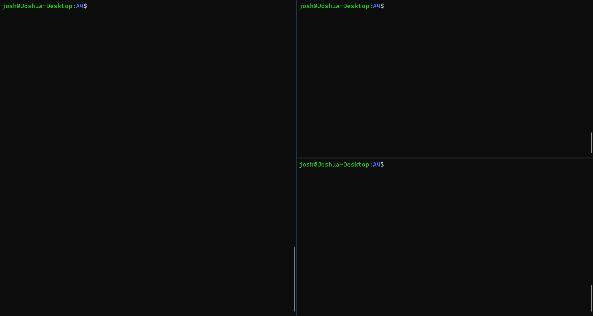

# CSC209 Message Board Server assignment
Assignment for CSC209 Winter 2023 session at the University of Toronto using C and sockets to create a message board server capable of handling commands and communicating basic messages to different users.
Written for the GNU99 C standard. Run and tested on Linux servers.

The server is launched by running the `friend_server` executable. The server can be connected to using the `netcat` utility and accepts text commands. Users log in via a username and communicate with others by posting onto their message boards.

The code in [friendme](friendme.c) was provided as starter code for the assignment but similar functionality was implemented in a previous assignment.

## Sample behavior

This code is uploaded to demonstrate my proficiency in the C language and should not be used to commit any academic offence.